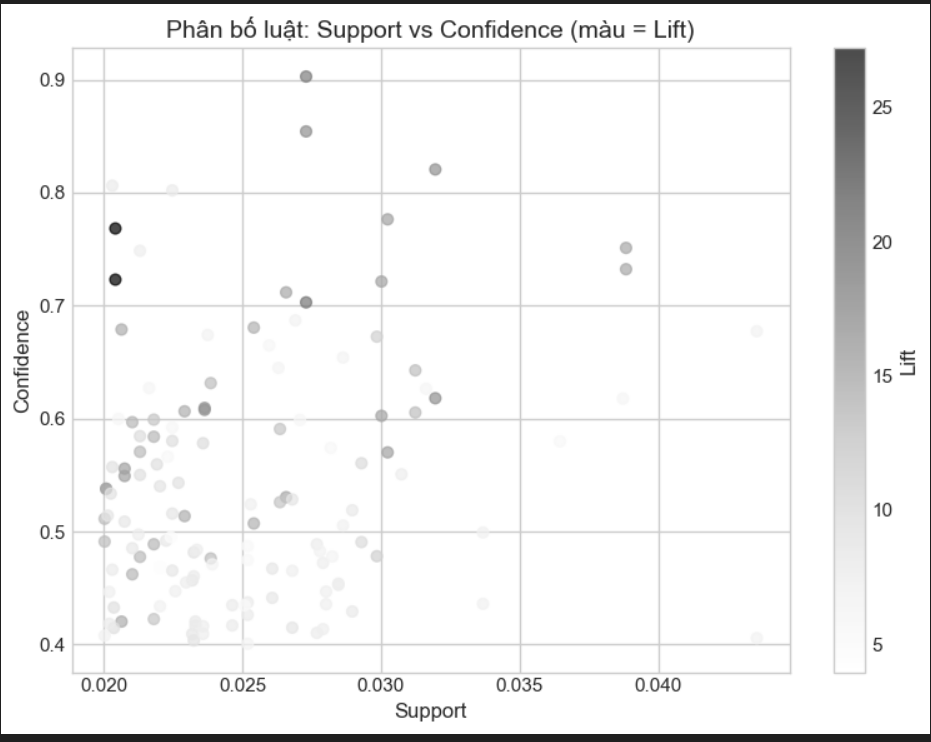
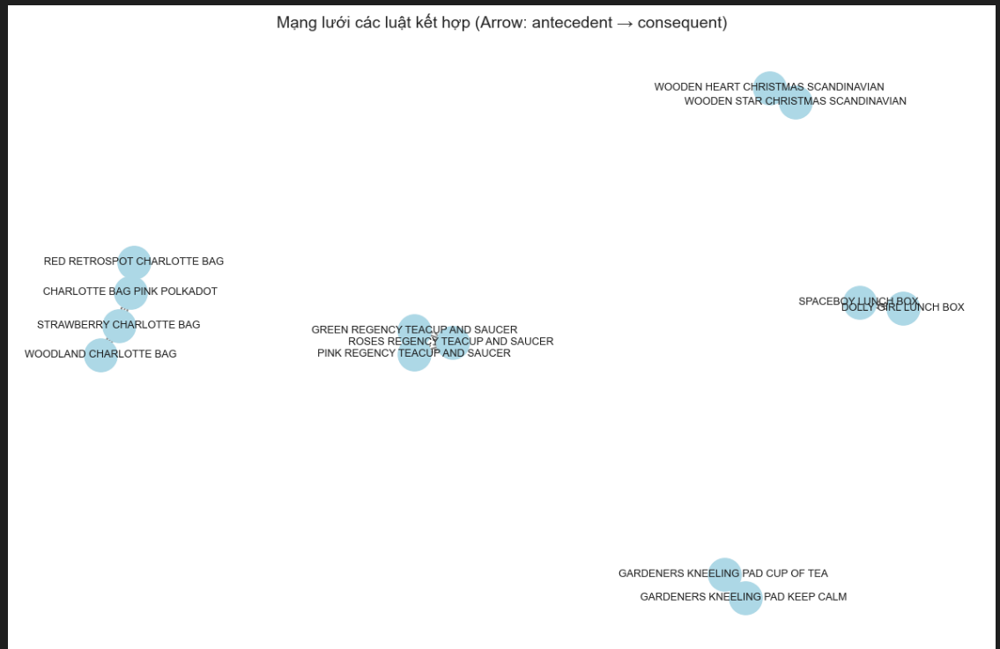

# Case Study: Phân tích giỏ hàng với Apriori

Phân tích dữ liệu bán lẻ để tìm ra mối quan hệ giữa các sản phẩm thường được mua cùng nhau bằng các kỹ thuật **Association Rule Mining** (Apriori). Project triển khai pipeline đầy đủ từ xử lý dữ liệu → phân tích → khai thác luật → sinh báo cáo.

---

## Thông tin Nhóm

- **Nhóm:** 3
- **Thành viên:**
  - Nguyễn Thanh Tùng
  - Lê Văn Vượng
  - Nguyễn Đức Anh
  - Đỗ Văn Tuyên
- **Chủ đề:**: Phân tích độ nhạy tham số, Tập trung vào luật “niche” (Hiếm nhưng Lift cao) 
- **Dataset:** Online Retail (UCI)

---

## Mục tiêu
Mục tiêu của nhóm là: Sử dụng thuật toán Apriori để phân tích hành vi mua sắm trực tuyến của khách hàng UK từ dữ liệu Online_Retail, nhóm sẽ đánh giá sự ảnh hưởng của việc thay đổi tham số support và phân tích sâu hơn về các luật hiếm, có giá trị cao để đề xuất kinh doanh cụ thể.

---

## 1. Ý tưởng & Feynman Style

- Apriori được dùng để tìm ra các sản phẩm phổ biến (frequent itemsets) thỏa mãn một ngưỡng độ phổ biến tối thiểu, gọi là ngưỡng support. Nói đơn giản hơn, Apriori sẽ duyệt qua các kết hợp sản phẩm (các cặp) được mua bán phổ biến và loại bỏ sớm những kết hợp sản phẩm không đạt tần suất xuất hiện tối thiểu.
- Apriori phù hợp cho bài toán vì: thuộc tính Apriori: “Mọi tập con của một tập hợp phổ biến thì cũng phải phổ biến", tức một bộ sản phẩm nào đó được mua bán thường xuyên thì mọi bộ sản phẩm mở rộng từ nó cũng có thể được mua bán thường xuyên.
- ý tưởng thuật toán: Một nhóm sản phẩm cha có các mặt hàng (A,B,C) phổ biến thì nhóm sản phẩm con (A,C) cũng phổ biến.

## 2. Quy trình thực hiện
Quy trình thực hiện như sau:

1) Load & làm sạch dữ liệu  
2) Tạo ma trận basket  
3) Áp dụng Apriori  
4) Trích xuất luật  
5) Trực quan hóa  
6) Phân tích insight  

## 3. Tiền xử lý Dữ liệu

- Những bước làm sạch: 
  - Loại bỏ sản phẩm "rỗng"
  - Loại bỏ các giao dịch bị hủy (InvoiceNo bắt đầu "C")
  - Loại bỏ những mục có Quantity hoặc UnitPrice âm hoặc bằng 0
  - Loại bỏ các dòng CustomerID 
  - Tính tổng giá trị mỗi dòng: Tạo cột mới TotalPrice Quantity × UnitPrice để biết doanh số của từng dòng sản phẩm trong hóa đơn.

- Thống kê nhanh:
  - Số giao dịch sau lọc: 485.123
  - Số sản phẩm duy nhất: 4.007

## 4. Áp dụng Apriori - Phân tích độ nhạy tham số - Tập trung vào luật niche

**Tham số sử dụng:**

- `min_support = 0.02`
- `min_threshold = 1.0`
- `max_len = 3`
- `FILTER_MIN_SUPPORT = 0.01`
- `FILTER_MIN_CONF=0.4`
- `FILTER_MIN_LIFT=1.2`

```python
from mlxtend.frequent_patterns import apriori, association_rules

frequent_itemsets = apriori(basket_df, min_support=0.002, use_colnames=True)
rules = association_rules(frequent_itemsets, metric="lift", min_threshold=1)
rules.sort_values("lift", ascending=False, inplace=True)
rules.head()
```
- Nhóm đã thử thuật toán với 3 lần ngưỡng min_support khác nhau để quan sát sự thay đổi:
- **min_support**: 0.01
  - số lượng luật: 1794
  - luật có lift cao nhất: ~74.57
  - chất lượng: nhiều niche cực cao nhưng về confidence thì thấp, có thể là nhiễu.
  - cụm sản phẩm nổi bật gồm: HERB MARKER (niche), JUMBO BAG (hub).

- **min_support**: 0.02
  - số lượng luật: 175
  - luật có lift cao nhất: ~27.20
  - chất lượng: chất lượng luật cân bằng, confi và lift đều có ngưỡng cao khá đều nhau.
  - cụm sản phẩm nổi bật gồm: WOODEN HEART/START, REGENCY TEACUP, JUMBO BAG.

- **min_support**: 0.03
  - số lượng luật: 21
  - luật có lift cao nhất: ~15.87
  - chất lượng: luật chỉ còn tập trung vào các mối quan hệ phổ biến nhất
  - cụm sản phẩm nổi bật gồm: REGENCY TEACUP, JUMBOO BA
- => Qua sự thay đổi lớn về số lượng, chất lượng của luật khi thử nhiều ngưỡng min_support khác nhau cho thấy không có ngưỡng nào phù hợp cho mọi mục đích khác nhau.
 - Đề xuất: Chọn min_support: 0.02 để mang tính cân bằng, phù hợp cho phân tích ra đưa ra chiến lược kinh doanh.


 - **Phân tích luật Niche**

- Luật niche thường là các luật có độ lift cao nhưng độ support thấp, trả lời cho câu hỏi khách hàng mua A thì việc mua B tăng gấp bao nhiêu lần.
- Các luật có lift cao, support thấp:
  - WOODEN HEART CHRISMAST SCANDINAVIAN <-> WOODEN STAR CHRISTMAS SCANDIAVIAN (sup: 0.0204 - lift: 27.20)
  - GREEN REGENCY TEACUP, ROSES TEACUP -> PINK REGENCY TEACUP (sup: 0.0273 - lift: 18.04).
- Các luật này tiết lộ hành vi mua sắm của khách hàng: khi WOODEN HEART CHRISMAST SCANDINAVIAN/ STAR là các món đồ trang trí vào dịp giáng sinh, nên chúng được mua cùng nhau như 1 cặp.
- Đề xuất bán hàng: Đóng gói sản phẩm theo cặp thay vì bán lẻ vào các dịp sự kiện hoặc mua 2 giảm giá sản phẩm còn lại đối với TEACUP.

## 5. Trực quan hóa 



**Hình 1.** Tối ưu hóa lift và confidence: Biểu đồ thể hiện sự phân bố của 135 luật kết hợp.
Trục X là support (độ phổ biến), trục Y là confidence (độ tin cậy của gợi ý), màu sắc/kích thước
đại diện cho lift (cường độ tương quan). Biểu đồ cho thấy mô hình tìm ra được nhiều luật có giá trị (Lift > 1 và Confidence > 0.5). Đặc biệt là những điểm màu đậm ở phía trên là "mỏ vàng" để tối ưu hóa doanh thu.

`Kiến nghị`: Nên tập trung vào các luật có Confidence > 0.7 và Lift > 15 (các điểm đậm phía trên) để sắp xếp lại kệ hàng hoặc hiển thị trên mục "Sản phẩm liên quan" của website, vì chúng mang lại xác suất chuyển đổi đơn hàng cao nhất.




**Hình 2.** Sản phẩm trung tâm (Product Hubs): Biểu đồ mạng thể hiện mối liên kết giữa các sản phẩm
quan trọng. Kích thước nút biểu diễn tần suất xuất hiện của sản phẩm trong các luật mạnh, trong khi
độ dày mũi tên thể hiện cường độ tương quan (lift). *JUMBO BAG RED RETROSPOT* là nút lớn nhất,
cho thấy đây là hub chiến lược cần được ưu tiên trưng bày để kích hoạt các giao dịch mua kèm.


## 6. Insight từ kết quả
1) Tối đa hóa lợi nhuận từ việc phân khúc niche
- Tối ưu hóa trưng bày sản phẩm bằng cách trưng bày riêng sản phẩm theo chủ đề (Giáng Sinh), đặt các sản phẩm này cạnh nhau hoặc đóng gói theo cặp.
2) Dùng sản phẩm Hub làm mồi nhử
- JUMBO BAG là sản phẩm có tần xuất suất hiện nhiều nhất, đặt sản phẩm hub này ở nơi có khu vực đông người qua lại, trung tâm hoặc gần kệ thu ngân.
3) Phân loại nhu cầu mua sắm tăng tỷ lệ chuyển đổi.
- Cần Phân biệt nhiều loại mua sắm của khách hàng, áp dụng chính sách nhiều khuyến mãi. 
4) Tối ưu hóa sàn thương mại điện tử
- Các giao dịch trực tuyến (DOTCOM POSTAGE) có mối quan hệ mạnh với việc mua JUMBO BAG RED. 
5) Kiểm soát rủi ro bằng cách đặt ngưỡng support hợp lý.
- Thiết lập một mit_support tiêu chuẩn để tập trung phân tích vào các bộ luật chất lượng.

## 7.  Kết luận & Đề xuất Kinh doanh

- **Chiến lược:** Các sản phẩm có lift cao tồn tại mối quan hệ liên kết gần như tuyệt đối, phải chuyển đổi bán lẻ thành gói sản phẩm combo.

- **Đề xuất kinh doanh:**
  - Trình bày sản phẩm trên kệ theo bộ sưu tập: Đặt các sản phẩm TEACUP trên cùng 1 kệ.
  - Tối ưu hóa vị trí hub: Đặt các sản phẩm này ở khu vực trung tâm hoặc đầu các dãy kệ.
  - Khuyến mãi theo mùa lễ hội hoặc khi mua số lượng lớn: Giảm 10% khi mua combo WOODEN HEART hoặc mua 3 túi JUMBO BAG bất kỳ.


## 8. Link Code & Notebook
- Notebook: [/runs/apriori_modelling_run.ipynb]
- Repo:[/https://github.com/nguyenthanhtung2k4/shopping_cart_analysis]

## 9. Slide trình bày
- Link Slide: []